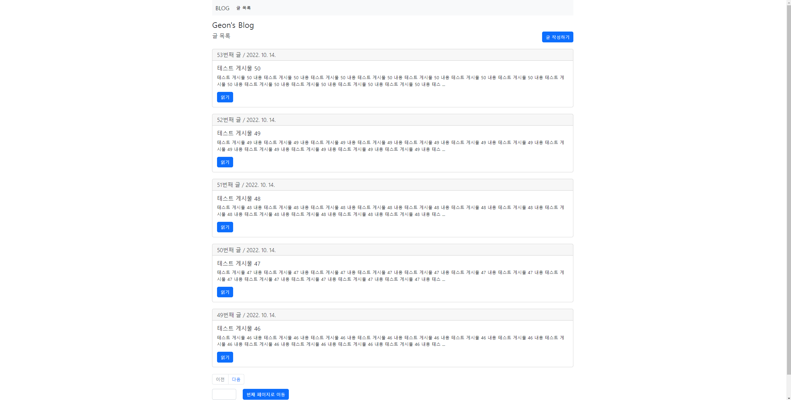
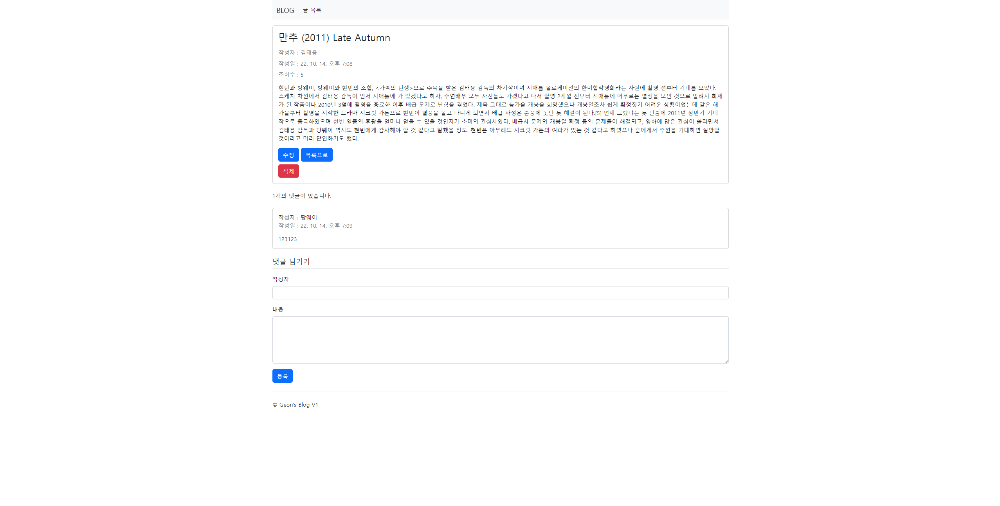
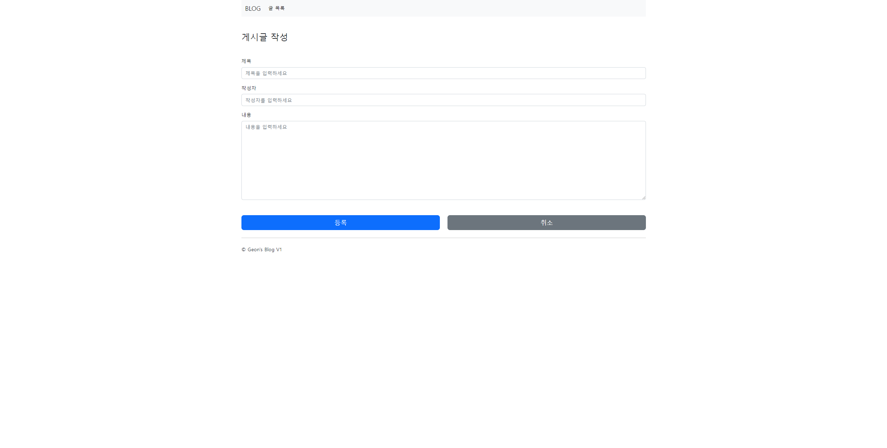
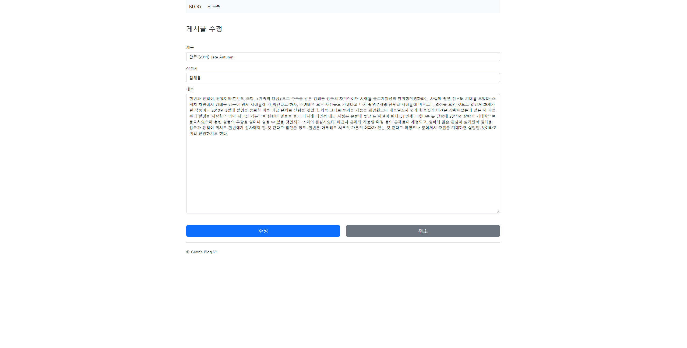

## 간단한 블로그 만들기 프로젝트

### 2022-10-13
* 프로젝트 시작
* 게시글, 댓글 도메인 작성
* 게시글 작성, 수정 페이지 html 작성
* 게시글 repository 작성

### 2022-10-14
* 조회수 기능
* 게시글 controller, 관련 DTO 작성
* 글 작성, 상세 조회, 수정, 삭제 기능 (CRUD)
* 게시글 목록, 상세 페이지 html 작성
* 게시글 목록 페이징 기능
  * 이전, 다음 페이지 버튼
  * 임의 페이지 이동 버튼
* 댓글 작성, 조회 기능

### 게시글 목록 페이지

### 게시글 상세 페이지

### 게시글 작성 페이지

### 게시글 수정 페이지
